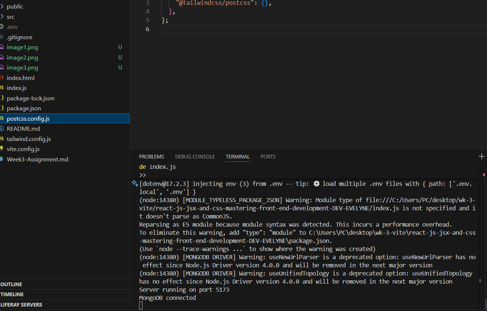
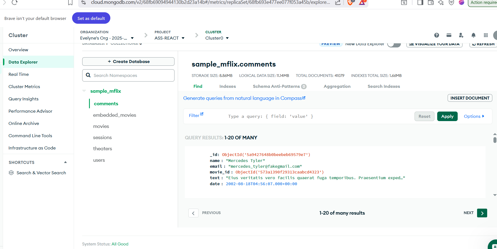

# PLP Task Manager

A responsive **React.js** application built with **JSX** and **Tailwind CSS v4**.  
This project demonstrates **component architecture**, **state management**, **hooks usage**, **API integration**, and **MongoDB Atlas backend integration**.

---

## Table of Contents

- [Features](#features)  
- [Project Structure](#project-structure)  
- [Installation](#installation)  
- [Environment Variables](#environment-variables)  
- [Running the App](#running-the-app)  
- [Screenshots](#screenshots)  
- [Deployment](#deployment)  
- [Contributing](#contributing)  
  

---

## Features

- Add, delete, and manage tasks  
- Filter tasks: All / Active / Completed  
- Dark and Light mode toggle  
- API integration to fetch tasks from a backend server  
- MongoDB Atlas connection for persistent data storage  
- Responsive UI with **Tailwind CSS v4**  

## Project Structure

root/
├─ node_modules/
├─ public/
│ └─ favicon.ico
├─ src/
│ ├─ components/
│ │ ├─ Button.jsx
│ │ ├─ TaskManager.jsx
│ │ ├─ Navbar.jsx
│ │ ├─ Footer.jsx
│ │ ├─ Card.jsx
│ │ └─ APIData.jsx
│ ├─ hooks/
│ │ └─ useLocalStorageTasks.jsx
│ ├─ context/
│ │ └─ ThemeContext.jsx
│ ├─ pages/
│ │ └─ Home.jsx
│ ├─ App.jsx
│ ├─ index.jsx
│ └─ index.css
├─ .env
├─ package.json
├─ tailwind.config.js
├─ vite.config.js
├─ README.md
└─ .gitignore

## Installation

Install dependencies:
npm install

Environment Variables
VITE_API_URL=http://localhost:5173/api/tasks
PORT=5173

Running the App
Start the backend server:
node index.js
Server should run on http://localhost:5173 and connect to MongoDB Atlas.

Start the frontend:
npm run dev
Open http://localhost:5173 in your browser.

Screenshots
Actual screenshots in screenshots

Deployment
Build the frontend:
npm run build
Deploy the dist/ folder to your hosting platform.

Deployed URL:
Deployed App:netlify https://dev-evelyne-task.netlify.app/
